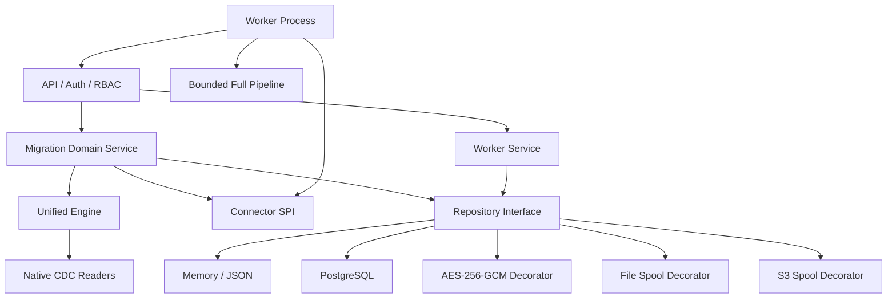
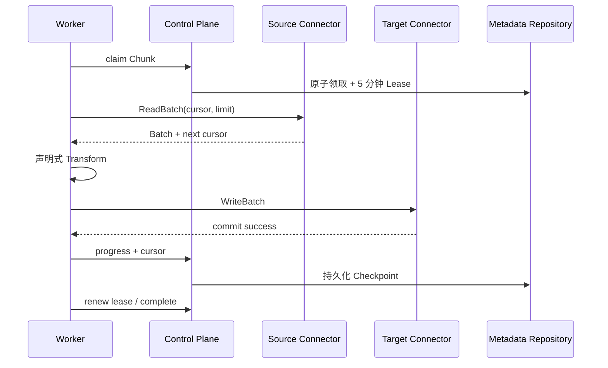
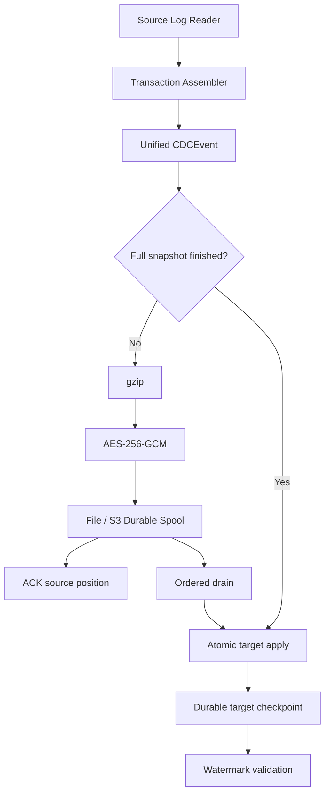

# QMigration 项目架构文档

文档基线：`0.15.0-rc49`  
分析日期：2026-09-02  
事实来源：当前仓库代码、部署清单和自动化脚本；历史 Release Notes 仅作参考。

## 1. 系统定位

QMigration 是统一数据库迁移平台，不是多个第三方迁移程序的启动器。用户只配置源端、目标端、迁移对象和策略；运行时固定使用 QMigration Unified Engine。

系统覆盖以下迁移生命周期：

1. 数据源管理与能力探测；
2. 迁移前检查和兼容性评估；
3. Schema/表规划；
4. 分片全量迁移；
5. 增量 CDC 捕获与回放；
6. 数据校验、验收报告和归档；
7. 割接、反向 CDC 和回切；
8. 监控、告警、审计和 Worker 调度。

## 2. 系统上下文

```mermaid
flowchart LR
    User[管理员 / DBA / Operator] --> Web[Vue 3 Console]
    Automation[自动化 / qmigrationctl] --> API[Go Control Plane API]
    Web --> API
    Prom[Prometheus] --> Metrics[/metrics]
    API --> Meta[(PostgreSQL Metadata)]
    API --> Spool[(Encrypted CDC Spool)]
    API --> Workers[Distributed Workers]
    Workers --> Source[(Source Database)]
    Workers --> Target[(Target Database)]
    Workers --> API
    API --> Archive[(S3 / WORM Report Archive)]
```

Web 和 CLI 属于管理面；Server 负责生命周期、策略和持久化；Worker 执行全量 Chunk 和被托管的 CDC Reader；源库与目标库属于数据面边界。

## 3. 运行时组件

| 组件 | 代码位置 | 主要职责 |
|---|---|---|
| Web Console | `web/src` | Vue 3 + Element Plus 管理界面，轮询和 WebSocket 实时状态 |
| HTTP API | `backend/internal/api` | REST、WebSocket、认证授权、审计、Prometheus 指标 |
| Migration Service | `backend/internal/migration` | 状态机、Precheck、规划、调度、校验、CDC、割接和回切 |
| Unified Engine | `backend/internal/engine` | 固定执行引擎；按源端协议选择 QMigration 自有 CDC Reader |
| Connector SPI | `backend/internal/connector` | 数据库能力描述、元数据、读写、DDL、CDC、拓扑、压力采样 |
| Full Pipeline | `backend/internal/pipeline` | Reader → 有界队列 → Transform → Writer → Checkpoint |
| CDC Runtime | `backend/internal/cdc` | 各厂商日志读取、解码、事务组装和统一事件模型 |
| Worker | `backend/cmd/worker` | 注册、心跳、领取/续租 Chunk、运行 CDC 子进程、上报进度 |
| Repository | `backend/internal/repository` | Memory/PostgreSQL 元数据实现，以及安全、File/S3 Spool 装饰器 |
| Validation Report | `backend/internal/validationreport` | JSON/HTML/PDF、哈希、Ed25519、TSA、S3/WORM 归档 |
| Maintenance | `backend/internal/maintenance` | 元数据保留策略和周期清理 |
| CLI | `backend/cmd/qmigrationctl` | 任务操作、报告验签和 Trust Store 生命周期 |

## 4. 前端架构

前端采用 Vue 3、Vue Router、Element Plus、TypeScript 和 Vite。页面按业务域划分：

- 首页：资源总览；
- 数据源：连接配置、测试、Schema 对象查看；
- 迁移任务：创建、执行、详情、Chunk、CDC、DLQ、冲突、报告；
- 校验中心、割接中心、监控中心；
- Worker、告警、审计、用户与权限、访问设置。

`web/src/api/client.ts` 统一处理 Session Token、静态 API Token、Blob 下载和 WebSocket 鉴权。Nginx 在生产镜像中托管静态资源并将 `/api/`、`/metrics` 代理到 Server。

当前前端仍是轻量管理台：业务状态主要留在各 Vue 页面内，Pinia 虽已安装但未承担统一会话、权限和任务状态管理。

## 5. 后端分层与依赖方向



主要依赖方向基本合理：API 调用领域服务，领域服务依赖 SPI/Repository，具体数据库实现位于基础设施层。需要注意的是 `migration.Service` 已同时承担过多应用服务职责，详见架构评估文档。

## 6. 全量迁移数据流



关键不变量：

- Reader 只允许有限预取，有界 Channel 提供自然反压；
- 目标写入成功后才提交 Cursor；
- 崩溃可能重放未确认批次，但不能跳过数据；
- Chunk 支持 Range、Bounded Keyset、Hash、Partition 和 Custom SQL；
- Worker Lease 过期后工作可由其他 Worker 领取；
- 控制面可根据数据库压力、Worker 负载和吞吐目标调整 Batch 与有效并行度。

## 7. Full + CDC 数据流



Spool 将 Full Snapshot 的耗时与源端日志保留窗口解耦。默认 File Spool 使用 `fsync + atomic rename`，S3 模式在应用层先加密后上传。目标 Apply 成功后才推进目标 Checkpoint；Spool 水位进入 CRITICAL 时停止确认源端，形成安全反压。

## 8. 生命周期状态机

主要路径如下：

```text
CREATED
  → PRECHECKING → PRECHECK_SUCCESS → PREPARING
  → [CDC_INITIALIZING]
  → FULL_MIGRATING → FULL_FINISHED
  → [CDC_CATCHING_UP]
  → [VALIDATING]
  → READY_FOR_CUTOVER → CUTOVER_RUNNING → FINISHED
  → [ROLLBACK_PREPARING → ROLLBACK_SYNCING → ROLLBACK_READY
     → ROLLBACK_RUNNING → ROLLED_BACK]
```

`PAUSED`、`FAILED`、`CANCELLED` 是旁路状态。状态转换由 `internal/migration/state_machine.go` 显式约束。

Server 为 Precheck 和 Validation 写入带 TTL 的 `control_operation_leases` 并持续续租。启动后每 30 秒巡检中断状态：Precheck 可安全重放，Validation 会清理本轮不完整结果后重跑；Prepare 一旦可能修改目标对象便不自动重放，租约过期后失败关闭并要求人工核查。Cutover/Rollback 尚未拆为持久 Saga，是当前控制面韧性的主要剩余缺口。

## 9. 数据与持久化

### 9.1 元数据

生产模式使用 PostgreSQL，保存：

- 数据源、用户、迁移任务、表和 Chunk；
- Worker、Engine Job、Lease、Checkpoint；
- Server 控制面 Operation Lease；
- CDC Position、Spool Index、DLQ、冲突记录；
- 校验结果、不可变 Validation Archive、报告归档登记；
- 告警、审计和任务日志。

开发模式可使用内存或持久化 JSON 文件。Memory/JSON 不适合多 Server 或生产规模。

### 9.2 敏感数据

`secure.Repository` 使用 AES-256-GCM 加密数据源密码、TLS 私钥、CDC DLQ/Spool 载荷。密钥由 `QMIGRATION_MASTER_KEY` 经 SHA-256 派生。丢失 Master Key 后相关密文不可恢复，因此它必须独立备份并由 Secret Manager 托管。

### 9.3 Schema 版本

Server 启动时会执行嵌入的幂等 `schema.sql`；外部脚本也可以按顺序执行 `backend/migrations/*.sql`。`/readyz` 会比较 `metadata_schema_state.schema_version` 与二进制版本，当前期望值为 `0.15.0-rc49`。

## 10. Connector 能力边界

能力通过 Descriptor 显式声明，任务启动时按 Full Read、Full Write、CDC Read、Transactional Apply 等能力失败关闭，不会静默回退到第三方迁移引擎。

| 数据库族 | 默认能力状态 | 备注 |
|---|---|---|
| MySQL、MariaDB、PolarDB MySQL、PolarDB-X | Native Full + CDC | 具体版本、权限和日志格式由 Precheck 校验 |
| PostgreSQL、PolarDB PostgreSQL | Native Full + pgoutput CDC | 依赖 replication slot / logical replication |
| TiDB | Experimental Full + TiCDC | 需要真实 TiCDC/Kafka 资格验证 |
| OceanBase MySQL | Experimental Full + Binlog Service CDC | SQL 与 CDC Endpoint 分离 |
| openGauss、Kingbase | 默认 Native Full Only | CDC 需显式实验开关和资格验证 |
| GaussDB | 默认仅 Probe | Full/CDC 均由独立实验开关控制 |
| Oracle、SQL Server、DB2、达梦 | 默认仅 Probe | 数据面已存在实验实现，生产使用必须通过资格验证 |
| GBase 8a、GBase 8s | 默认仅 Probe | 依赖实验开关；8s/达梦还依赖厂商驱动 Provider |

运行时应以 `GET /api/v1/connectors` 返回的 Descriptor 为准，不应只根据数据库名称推断支持度。

## 11. 部署拓扑

### Docker Compose

包含单 PostgreSQL、单 Server、单 Worker 和单 Web。数据库密码、Master Key、Worker Token 与 Auth Secret 必须由私有 env 文件提供；新部署管理员使用显式初始默认值并要求首次登录后修改。Server 开启生产安全校验和强制认证；端口默认只绑定宿主机回环地址。该拓扑适合开发和单机验证，不提供数据库高可用。

### Kubernetes 示例

默认包含两个 Server、三个 Worker、两个 Web、HPA、三组 PDB 和共享 RWX Spool PVC。应用副本使用 hostname Topology Spread 和 Pod Anti-Affinity 跨节点分散；副本数和 HPA 上限可由安装器调整。清单不内嵌运行 Secret，临时 DaemonSet 会在部署前验证每个可调度节点的离线镜像。内置 `postgres.yaml` 仅用于测试/小规模环境，生产多节点通过安装器接入外部 HA PostgreSQL，并使用外部 Secret、不可变 Digest、NetworkPolicy 和可信 Ingress/TLS。

多 Server 的 File Spool 必须共享同一个 RWX 文件系统；也可以使用 S3-Compatible Spool。PostgreSQL 中的 Drain Lease 用于避免多 Server 同时回放同一方向。

## 12. 对外接口

- 管理 REST：`/api/v1/*`；
- 实时事件：`/api/v1/ws`；
- Worker 内部接口：`POST /api/v1/workers/*`；
- Liveness：`/healthz`；
- Readiness：`/readyz`；
- Prometheus：`/metrics`。

API 覆盖数据源、迁移、校验报告、CDC、DLQ、割接、Worker、用户、告警和审计。当前没有 OpenAPI 文件，接口契约以 Go Handler、Domain Model 和 CLI 为准。

## 13. 安全模型

- 账号密码登录签发有时效的 Session Token；
- 静态 RBAC Token 适合自动化；
- 角色为 Admin、DBA、Operator、Viewer；
- Worker 使用独立 `X-QMigration-Worker-Token`；
- 数据源 TLS 支持 DISABLE、PREFERRED、REQUIRED 和双向证书字段；
- API 可直接 TLS 或由可信代理终止 TLS；
- 数据源凭据与 CDC 载荷静态加密；
- 审计记录包含 Actor、Action、资源和 Remote Address；
- 验收报告支持 SHA-256、Ed25519、公钥轮换/撤销、RFC3161 TSA 和 S3/WORM。

安全默认值和待补能力见[架构评估与缺失功能](ARCHITECTURE_ASSESSMENT.md)。
